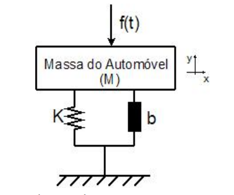
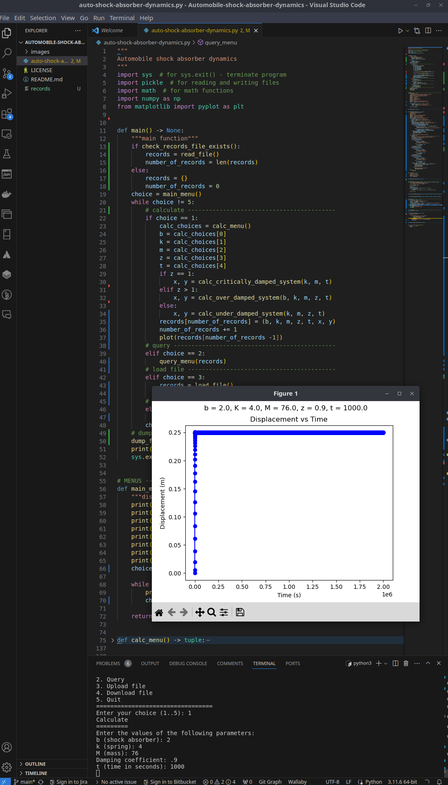

# Automobile-shock-absorber-dynamics
## Math and physics concepts

The vertical displacement of the vehicle is dependent on the characteristic of the spring (K), the shock absorber (b), vehicle mass (M).

The characteristic of the spring (K) and the shock absorber (B), relates to the natural frequency of the system (ꞷ) and the damping coefficient (ɀ):

- K = ꞷ2M
 - b = 2ɀꞷM

Depending on these conditions, this system can behave in 3 ways 
of different dynamics:

- **Critically damped system (ɀ = 1)**:

  y1 = ( 1 / Ma2 ) (1 - at - e-at ), where
    - a = ɀꞷ

- **Over-cushioned system (ɀ > 1)**:

  y2 = ( 1 / Mba ) ( ( 1 + ( 1 / ( a - b ) ) ( be-at - ae-bt ) ) ), where
    - a = ɀꞷ + ꞷ √( ɀ2 - 1 ) 
    - b = ɀꞷ - ꞷ √( ɀ2 - 1 )
    note: this coefficient b is only an equation parameter (calculated by the above expression) and NOT the shock absorber coefficient.

- **Under-cushioned system (ɀ < 1)**

  y3 = ( 1 / K ) ( 1 - ( 1 / ( √( 1 - ɀ2 ) e ɀꞷt ) ( sin ( ꞷ√( 1 - ɀ2t ) + ⱷ ) ) ) ), where
    - ⱷ = tan-1 ( ( 1 - √( 1 - ɀ2 ) ) /  ɀ )

Settling time (time until shock absorber stabilizes):

- ts = 4 / ( ɀꞷ )

## Application requirements

The app calculates the system dynamic behavior in the 3 situations with the following requirements:

-   Calculate the function y(t), for different instants of time , considering suspension and vehicle characteristics provided by the user (the user should provide the values of b, K, and M). The calculation should be carried out for t ∈ [0, 2t2] s, with interaction steps ts / 1000. 
- Values entered by the user are validated.
 - It will display graphs showing developments in the field of 
vehicle movement over time, for t ∈ [0; 2t2] s.
- The user can make changes to the data stored in the database and view the new results
- It will provide to the as a result of the execution of the 
program:
  - If the system is under-damped, the overimpulse value (mp) and the accommodation time (ts, auxiliary expression presented below)
      - mp = e ( ( -ɀ / √( 1 - ɀ2 ) ) π )
  - If the system is over-damped or critically damped, the value 
accommodation time (ts)
- It will be possible to carry out calculations on shock absorbers 
with different features.
- It will be possible to save all calculated simulations in one
user-defined file.
- The graphics displayed can be saved in files with given names 
by the user.
- It will be possible to keep the saved data for future use.

## Implementation guide

- 1 - Import of all libraries
- 2 - Creation of the menu.
  - a.Display options (calculating, querying and uploading/downloading files)
  - b. Ask for choice.
- 3 - IF the choice is to calculate
  - a. Ask for the values of b, K and M (all in float variables).
  - b. Calculate ζ (in float variable)
    - i. Depending on the system ζ, calculate a different function.
  - c.Display the graph of the function in the interval t ∈ [0; 2ts] s, using the matplotlib library
  - d. Save values in a list, saving the data of each calculation in a dictionary
  - e. Do this for as many times as the user wishes
- 4 - IF the choice is to consult, ask for the number of the experiment or the number of the values of b, K or M.
  - a. Distinguish how the user wants to search and present all hypotheses
- 5 - IF the choice is to load, use pickle.load (all pickle files will be used in byte mode and with the same name. The goal is to use the files only in the program made, to save time and space the files will be replaced).
- 6 - IF the choice is to download, use pickle.dump (all pickle files will be used in byte mode and with the same name. The goal is to use the files only in the program made, to save time and space the files will be replaced).

## Screenshot

